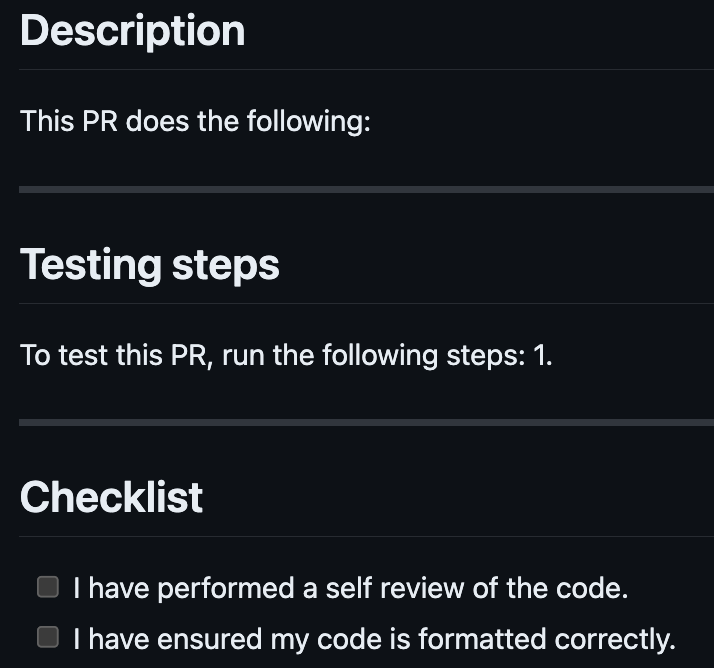

# Spotify Wrapped

## User Stories

### User Story 1

#### Login
To login to Spotify and retreive a token, we first setup an API in the Spotify Dashboard. Then using the Spotify authentication system we prompt the user to log in. We locally store a token in a `ViewPager` so that it can easily be accessed by any of our fragments.

#### Information Retrieval and Display
For the Spotify Wrapped we focused on six main pages – Top Songs, Top Artists, Top Genres, Audio Features, Recommended Artists, and LLM Description of Tastes and Styles.

For the Top Songs and Top Artists pages, we used the top items endpoint. We implemented a callback function such that once we receive the contents we call another method. This method takes in the top 5 artists and uses the artist information endpoint to retrieve information about each artist. Using this information we create a list of the top genres of the user. 

We also got access to the Audio Features of a user such as Acousticness, Danceability, Instrumentalness, and Liveness. We represented the numeric values for these features using sliders in our Spotify Wrapped. As there isn't a direct Recommended Artists endpoint for a user, we use the recommended tracks from Spotify and analyze them to extract the top artists for a user. We then use this data to recommend artists to the user.

### User Story 2

To log into the app, we use Firebase authentication. This way, all account information is stored in the cloud, and persists across devices and sessions, even if the user logs out.

Whenever a Spotify summary is generated, it is stored in Firestore. We provide a screen where the user can view a list of past generated wraps. The user can also delete past summaries.

The account settings page allows users to perform the following three main actions:
- Sign Out - Signs the user out of the app
- Update Profile - Allows the user to change their name and password
- Delete Account - Deletes the user account

### User Story 3
_As a user, I would like for an LLM API to dynamically describe how someone who listens to my kind of music tends to act/think/dress during my Spotify Wrapped._

In the `WrappedFragment` of our app, we dynamically generate descriptions of user behaviors, thoughts, and fashion preferences using Google's Gemini Pro API, based on their top Spotify artists and songs. User data fetched from Spotify is processed by the LLM to craft personalized narratives. Managed asynchronously with Android's LiveData and ViewModels for state and UI updates, these narratives are displayed in-app and stored in Firestore for persistence. This integration of real-time music data with advanced AI content generation significantly enhances user engagement by personalizing their music listening experience.

### User Story 4
_As a user, I would like new artists recommended to me based on my music tastes._

For user story 4, we had to implement a way to recommend new artists to the user based on their music tastes.  Although there wasn't an API to get the recommended artists, fortunately, for this implementation we had access to the recommended tracks endpoint by Spotify API. This endpoint returns a list of Spotify tracks. Using this we extracted all the artists across all these tracks and ranked them on the basis of how often they are found in the tracks. We then presented this curated list to the user.

### User Story 5
_As a user, I would like to control the timespan of the generated Wrapped summary._

Upon clicking the "Spotify Wrapped" button to generate a new Wrapped summary, the user is prompted with a menu of possible time frames. Once one option is selected, a Spotify Wrapped summary will be generated with respect to data from that timespan. Thus, the user becomes satisfied with the ability to control the timespan of the generated Wrapped summary.

### User Story 6
_As a developer, I would like a CI/CD pipeline to test my code to verify that it builds and is formatted correctly._

We set up a workflow in GitHub by using a YAML file in the `.github/workflows` folder. This workflow is triggered every time someone pushes changes to a branch. The workflow sets up the correct  JDK environment, ensures `gradle build` works, and checks code formatting and static errors.

We set up a branch protection rule, where changes cannot be directly pushed to main. Instead, you must create a new branch, and then submit a pull request (PR). The branch protection rule dictates that the PR needs to be approved by at least one other person and that it must pass the CI workflow in order to be merged into main.

### User Story 7
_As a user, I would like to be able to sign into my account from any device (Firebase cloud storage instead of SQLite)_

We implemented Firebase authentication and storage in our app. The user has to create an account on our app using their email. This authentication is handled by Firebase. Whenever the user generates a new Spotify Wrapped, the details are stored in Firestore. This allows the user to view their past generated wraps. Firebase allows the user to log in and sign out from any device.

### User Story 8
_As a developer, I would like to be able to use pre-made templates for PRs and issues in GitHub._

We created a PR template by adding a markdown file named `pull_request_template.md` to the `docs` folder in our repository. Below is a screenshot of the empty PR template on the left.

We created an issue template by adding the file `.github/ISSUE_TEMPLATE/bug_report.md`. Below is a screenshot of the empty template on the right.

## Process
In organizing our project work using the Scrum framework, we adopted 2.5-week sprints to balance momentum with flexibility. Sprint planning kicked off each sprint, where the team, guided by the product backlog priorities, committed to tasks. This process relied on Trello for backlog management and sprint tracking, visually representing our progress. Daily stand-ups, conducted via Discord, ensured continuous communication, allowing the team to address blockers and adapt plans quickly. At the end of each sprint, we held a sprint review to demonstrate completed work to stakeholders, facilitating immediate feedback. This cycle concluded with a retrospective meeting to reflect on the sprint's successes and challenges, aiming for continuous process improvement. Our approach, structured around these Scrum ceremonies and supported by Trello, was designed to maintain focus, foster collaboration, and drive efficient delivery. 

When developing the Spotify Wrapped application we had many design ideas that needed to be sorted, initially, we were stuck on how to display the information for the user's wrapped. Displaying the information for the user's wrapped proved to be a challenging design decision, however, we decided to follow a more simplistic approach to displaying the information. We wanted to make the wrapped experience easy to approach, hence our decision to make the app this way. 

Another challenge we had when following this simplistic approach was how to recommend new artists. We wanted to follow the very complex algorithm Spotify uses to determine what artists to recommend, however, with the limited information we could retrieve from the API. Instead, we decided to use the user's history to determine what genre they listened to most and what artist would be closest to the user's preference in genres. 

When using the Trello board we separated activities with what to do, currently working on, what needs to be reviewed, and what is already done. We assigned activities to other people with certain activities having two people, we assigned the activities based on what we wanted to work on or based on our abilities. Activities with two people were selected on the basis that they required more work than the other activities or because we wanted to collaborate to speed up the process. The image below shows an example of our Trello board's history.

## Team
I worked on this project with a group of peers at Georgia Tech.
